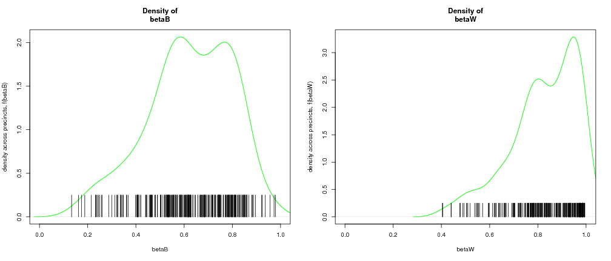
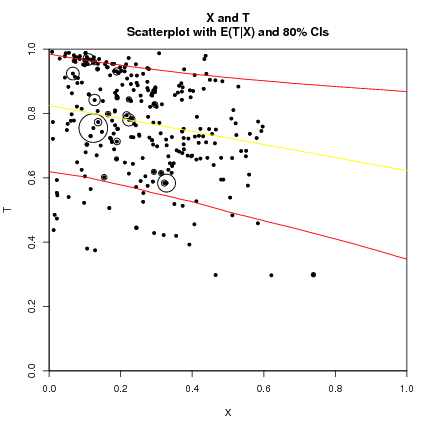
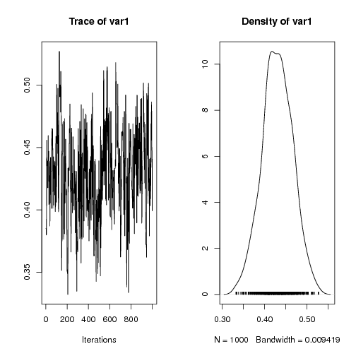
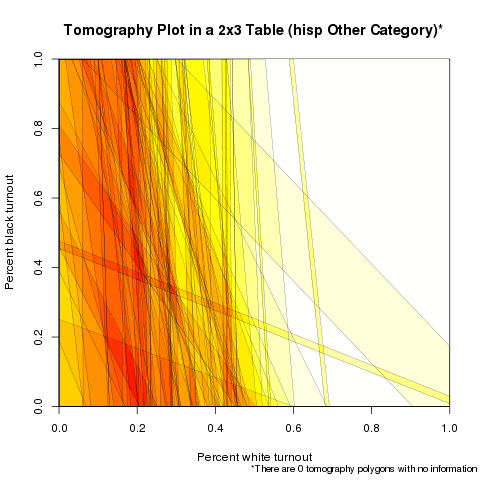
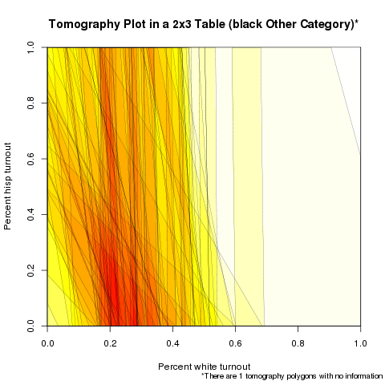

```{r, include = FALSE}
knitr::opts_chunk$set(
  collapse = TRUE,
  comment = "#>"
)
```

# Introduction: Ecological Inference

This program provides methods of inferring individual behavior from
aggregate data. It implements the statistical procedures, diagnostics,
and graphics from the Gary King, **A Solution to the Ecological
  Inference Problem: Reconstructing Individual Behavior from Aggregate
  Data** (Princeton: Princeton University Press, 1997),
[http://j.mp/ecinfbook](http://j.mp/ecinfbook); Ori Rosen, Wenxin Jiang, Gary King, and
Martin A. Tanner (2001) ``Bayesian and Frequentist Inference for
Ecological Inferece: The RxC Case.'' (*Statistica Neerlandica*,
Vol.55, nr.2, pp 134-156), [http://j.mp/eiRxC](http://j.mp/eiRxC); and from our own
ongoing work.  Except where indicated, all references to page,
section, chapter,
table, and figure numbers in this document refer to the the first reference.

Ecological inference is the process of using aggregate
(i.e., ``ecological'') data to infer discrete individual-level
relationships of interest when individual-level data are not
available.  Ecological inferences are required in political science
research when individual-level surveys are unavailable (e.g., local or
comparative electoral politics), unreliable (racial politics),
insufficient (political geography), or infeasible (political history).
They are also required in public policy (e.g., for applying the Voting
Rights Act) and other academic disciplines ranging from epidemiology
and marketing to sociology and quantitative history. Most researchers
using aggregate data have encountered some form of the ecological inference problem.

Because the ecological inference problem is caused by the
lack of individual-level information, no method of ecological
inference, including that estimated by this program, will always
produce accurate results.  However, potential difficulties are reduced
by models that include more available information, diagnostics to
evaluate when assumptions need to be modified, easy methods of
modifying the assumptions, and uncertainty estimates for quantities of
interest.  We recommend reviewing Chapter 16 while using this program
for actual research.  Model dependence defines ecological inference
when going anywhere beyond the bounds and tomography plots, and so we
have added new graphical procedures for evaluating the degree of model dependence.

`ei` is a unifed program that contains methods for
both the 2x2 ecological inference case and the RxC case.  We will
begin by explaining how to use eiR in the 2x2 case, and then move on
to RxC examples.

# Overview: 2x2 R-commands

In this section we describe the basic commands for 2x2 inference.  For
this purpose, and without loss of generality, we use the running
example from the book portrayed in Table 2.3 (page 31).  This example
uses the proportion of the voting age population who are black
($X_i$), the proportion turning out to vote ($T_i$), and the number
of voting age people (${N_i}$) in each precinct ($i=1,\ldots,p$) to
infer the fraction of blacks who vote ($\beta_i^b$) and the
proportion of whites who vote ($\beta_i^w$), also in each precinct.
(For an extended example of `ei`, refer to the user's guide
below.)  An example of a sequence of these commands are as follows:

```{r,, eval = FALSE}
formula <- t ~ x
dbuf <- ei(formula = formula, total = "n", data = data)
summary(dbuf)
eiread(dbuf, "betab", "betaw")
plot(dbuf, "tomog", "betab", "betaw", "xtfit")
```

In most applications, `plot` and `eiread` 
would likely be run multiple times with different options chosen, and other commands would 
be included with these five to read in the data (`t`, `x`, and `n`).

### `ei`: To run the main procedure
  Use the format, `dbuf = ei(formula, total = "n", data = data)`, which takes three $p\times 1$ vectors as inputs: `t` (e.g. the fraction of the
  voting age population turning out to vote); `x (e.g. the
  fraction of the voting age population who are black); and `n`
  (e.g. the total number of people in the voting age population). The output of this
  procedure is the list `dbuf` (i.e. an output object of class
  list called a "data buffer").  The data buffer includes the maximium likelihood estimates and simulated quantities of interest from the `ei` procedure. After running `ei`, it is a
  good idea to save `dbuf` for further analysis.  The
  output data buffer from `ei` includes a large variety of
  different results useful for understanding the results of the
  analysis. A minimal set of nonrepetitive information is stored in
  this list (or data buffer), and a large variety of other information
  can be easily computed from it. Fortunately, you do not need to know
  whether the information
  you request is stored or computed as both are treated the same.
 
 
 To extract information from the data buffer, three
  procedures are available:

### `summary`: To obtain a general summary of district-level information
  `summary(dbuf)` will produce aggregate information about the
  `ei` results.  `summary` will produce a summary of both the maximum likelihood estimates and simulated quantities of interest. It also includes information on the values specified for the prior.

### `plot`: To graph relevant information
  For graphics, use `plot(dbuf, "name")`;, where `dbuf` is
  the ei.object that is the output of `ei` or `ei.sim`, and name can be any number
  of a long list of ready-made graphs.  For example,
  `plot(dbuf,"tomog")` will plot a tomography graph, and
  `plot(dbuf,"xt")` will display a scattercross graph. Any number
  of graphs can be selected in plot for output.  For example,
  `plot(dbuf,"tomog","xt")` will produce both a tomography graph
  and a scattercross graph.

  Some of the plots can be produced after estimating the maximum likelihood estimates using `ei`, but before simulating quantities of interest. These initial plots can be useful in determining which priors to include, and the user can opt to choose not to simulate quantities of interest by selecting the option `simulate = FALSE`. However, for some plots, `plot` will need the simulated quantities of interest, and therefore can only be plotted when simulate is set to the default, `TRUE`.
  
### `eiread`: To obtain relevant information and numerical results

  For numerical information, use `v <- eiread(dbuf, "name")`,
  where `v` is the item extracted, `dbuf` is the data buffer
  output from `ei`, and name can be any of a list of output
  possibilities. For example, `eiread(dbuf, "betab")` will give a
  vector of point estimates of $\beta_i^b$,
  `eiread(dbuf, "ci80w")` will give 80\% confidence intervals for
  $\beta_i^w$.  Any number of items can be selected for output.  For
  example, `eiread(dbuf, "betab", "ci80b")` will produce a list
  of the point estimates and 80\% confidence intervals for $
  \beta_i^b$.

# User's Guide: An Example

We now show how to use `ei` through a simple example. We use data
on voter registration and racial background of people from 268
counties in four Southern U.S. States: Florida, Louisiana, and South
Carolina.  These are the same data used in Chapter 10. The data
include the total voting age population in each county (`n`), the
proportion of the population in each county who are black (`x`),
and the proportion of the population in each county who are registered
to vote (`t`).  The proportion of whites registered can be
computed by (`1-x`). You can load the data into R using the
command


```{r}
library(ei)
data(matproii)
```

The statistical goal is to estimate the fraction of blacks registered ($\beta_i^b$) and the fraction of whites registered ($\beta_i^w$) in each county. These quantities of interest are generally unknown.  However, `ei` also includes an option that allows the user to assess the reliability of the `ei` algorithm when the true quantities of interest are known. To illustrate the use of this ``truth" option, the data also include the true fractions of registered blacks (\verb#tb#) and the true fraction of registered whites (`tw`). 

## The Basic EI Algorithm

To begin, we perform ecological inference by calling the function
`ei`. `ei` first computes and maximizes a likelihood
distribution based on the inputed data, then estimates the county-level
quantities of interest based on the possible values, or ``bounds", for
each county and the overall likelihood distribution.

To run this algorithm, at a minimum we need to have three vectors.  Two
vectors, `t` and `x`, contain the aggregate known
information about the counties of interest.  In this example, `t`
is the proportion of voters registered in each county, and `x` is
the proportion of blacks in each county.  These two vectors contain
aggregate information, since we are interested in the proportion of
voters in each country who are black.  The last vector we need is
`n`, the number of people of interest in each county.  In this
example, `n` is the number of people of voting age. 


We proceed by performing ecological inference without covariates on the data:

```{r}
formula <- t ~ x
dbuf <- ei(formula = formula, total = "n", data = matproii)
```

 To include a covariate on $\beta_i^b$ simply specify a covariate vector for the option \verb#Zb#, or a string that refers to the name of the covariate in the dataset.  Similarly, to include a covariate on $\beta_i^w$, specify a covariate vector for for the option \verb#Zw#, or a string that refers to the name of the covariate in the dataset.


Next, we use \verb#summary(dbuf)#and \verb#summary(dbufsim)# to obtain general information about the estimation. 

```{r}
summary(dbuf)
```

\begin{verbatim}
Erho = 0.5 , Esigma = 0.5 , Ebeta = 0.5 , N = 268 , Resamp = 35

Maximum likelihood results in scale of estimation (and se's)
    Bb0    Bw0    sigB    sigW    rho Zb Zw
 1.2670 1.9348 -1.1151 -1.3272 1.6051  0  0
 0.2775 0.2757  0.2132  0.1640 0.3120  0  0

Untruncated psi's
     BB     BW     SB     SW    RHO
 0.9758 1.1411 0.3325 0.2713 0.9082

Truncated psi's (ultimate scale)
     BB     BW     SB     SW    RHO
 0.6208 0.8259 0.2006 0.1425 0.7489

Aggregate Bounds
       betab  betaw
lower 0.2125 0.7025
upper 0.9754 0.9200

Estimates of Aggregate Quantities of Interest
     mean     sd
Bb 0.5714 0.0253
Bw 0.8177 0.0072

\end{verbatim}

 The `summary` function provides basic information about the ecological inference estimation, the maximum likelihood estimates on three scales, and an overall summary of the quantities of interest.  First, it reports the values of the priors used in ecological inference (`Erho, Esigma, Ebeta`).  It also reports the number of counties in the dataset (`N`), as well as the number of importance sampling iterations required to produce estimates of the quantities of interest (`resamp`).  


`summary` also produces information both about the maximum likelihood estimates and the quantities of interest.  First, it provides the maximum likelihood estimates in the scale of estimation. Next, it provides the values of the MLEs when they are transformed into an untruncated bivariate normal distribution.  These estimates provide information about the location of the highest density of estimates for the proportion of blacks who are registered to vote and the proportion of whites who are registered to vote.  Last, it provides the values of the MLEs on the ultimate truncated bivariate normal scale.  These estimates are an unweighted average of the fraction of blacks and whites registered to vote over all the counties in the sample.  In this example, the `ei` algorithm predicts that the unweighted average of the proportion of blacks registered to vote across counties is 0.57 and the unweighted average of the proportion of whites registered to vote is 0.82.


Finally, `summary` produces information on aggregrate quantities of interest.  The aggregate bounds are the mean of the bounds on the proportions of black and white voters, weighted by the population in each county.  The aggregate quantities of interest are the weighted mean of the proportion of registered blacks and the proportion of registered whites in each county.  In this example the weighted average proportion of blacks who are registered is 0.57, and the weighted average proportion of whites who are registered is 0.82.  

## Extracting Quantities of Interest 

`eiread` extracts quantities of interest in a list format from the object `dbuf`.  For example, 

```{r}
bb.out <- eiread(dbuf, "betab", "sbetab")
```

 extracts the point estimates and estimated standard deviations for $\beta_i^b$, the estimates of the proportion of registered blacks in each county.  The user can then use `bb.out$betab` to obtain a vector of the point estimates for $\beta_i^b$, and `bb.out$sbetab` to obtain a vector of the standard devations for $\beta_i^b$.  
\newline
`eiread()` takes any number of arguments to extract any number of quantities of interest from the data buffer.  `?eiread` can be used to find a list of quantities of interest that are available in `ei`.  Among the most useful arguments are `"betab"` and `"betaw"`, which report the point estimates; `"sbetab"` and `"sbetaw"`, which report the standard deviations of the point estimates; and `"CI80b` and `"CI80w"`, which report the confidence intervals of the point estimates.  

## Plotting in EI

Plotting `ei` output is extremely useful for understanding the results of the ecological inference algorithm and diagnosing problems with estimation.  First, we graph a tomography plot of the data (Figure 1).

```{r, eval = FALSE}
plot(dbuf, "tomog")
```

```{r echo = FALSE, eval = FALSE} 
plot(dbuf, "tomog")
```

 

```{r echo = FALSE, eval = FALSE}
plot(dbuf, "tomogE", "tomogCI")
```


 Each line on the map represents the possible values for $\beta_i^b$ and $\beta_i^w$ for one county.  The contour lines identify the portion of the lines that have the highest probability of containing the true estimates of $\beta_i^b$ and $\beta_i^w$.  These contour lines provide information about the overall pattern of registration.  Note that the area with highest probability is in the upper right-hand corner, where the proportion of whites registered is between $0.75$ and $1$ and the proportion of blacks registered is between $0.5$ and $1$.  Further, we see that the lines are clustered in the upper half of the figure, indicating that the possible values of $\beta_i^w$ will have a lower variance than the possible values of $\beta_i^b$.
\newline
Figure 2 is a double plot of the point estimates and their confidence intervals.  To compute this, we call plot to generate two graphs: a tomography plot with the point estimates generated from the algorithm, and a tomography plot with 80\% confidence intervals on the point estimate.  

```{r, eval = FALSE}
plot(dbuf, "tomogE", "tomogCI")
```

 This plot is useful to visualize the estimates and confidence intervals for each county.  We can see that the point estimates and confidence intervals are clustered in the same area as the contours from the previous plot.  Further, the point estimates and confidence intervals only fall on the lines that indicate the possible values of $\beta_i^b$ and $\beta_i^w$.
\newline
Figure 3 shows plots that indicate the distribution of $\beta_i^b$ and $\beta_i^w$. To produce these plots, run:

```{r, eval = FALSE}
plot(dbuf, "betab", "betaw")
```

 Density plots are useful to visualize the location and uncertainty of the point estimates.  The green line represents the density of the simulated point estimates, and the black tick marks are a rug plot of the point estimates,s $\beta_i^b$ and $\beta_i^w$.  You can see that the variance of the point estimates from $\beta_i^b$ is much higher than the variance of point estimates from $\beta_i^w$.  
\newline
Figure 4 portrays the results of the `ei` algorithm by plotting the proportion of blacks in each country by the proportion of registered voters in each county.  To produce this plot, use:

```{r, eval = FALSE}
plot(dbuf, "xtfit")
```

 The circles around each of the points in this plot are proportional to the population of each county.  The graph represents the likelihood estimates by plotting the expected number of registered voters given the proportion of blacks in each county, represented by the yellow line. The red lines in the plot are the 80\% confidence interval around the regression line.  The higher uncertainty in the estimates of black registration can be seen by the absence of points on the right hand side of the graph and the larger confidence interval on the right hand side of the graph, where the proportion of blacks in the county is relatively large.  


```{r echo = FALSE, eval = FALSE} 
plot(dbuf, "betab", "betaw")
```




```{r echo = FALSE, eval = FALSE} 
plot(dbuf, "xtfit")
```

 


\pagebreak
 Finally, if we have data on the true proportions of registered blacks and registered whites in each county, as we do in this dataset, we can use plots in `ei` to assess how well the algorithm works on the given data.  To do this, rerun the `ei` algorithm, adding the truth vectors, \verb#tb# and `tw` as the truth argument.

```{r}
truth <- cbind(matproii$tb, matproii$tw)
formula <- t ~ x
dbuf <- ei(formula = formula, total = "n", data = matproii, truth = truth)
```

Then use plot to compare the estimates of the `ei` algorithm to the true proportions of white and black registered voters in each county.

TODO: set eval = TRUE
```{r, eval = FALSE}
plot(dbuf, "truth")
```

The "truth" plot (Figure 5) has four components.  The top two figures have the posterior densities of the aggregate quantities of interest $B^b$ and $B^w$.  These densities tell us in what range the algorithm predicts that the point estimates lie.  For example, the density of $B^b$ is wider than the density of $B^w$, indicating that our estimates of $B^w$ lie in a smaller range than than our estimates of $B^b$.  The true aggregate values, computed from the \verb#truth# data we inputed, are indicated by the vertical bars.  The fact that the true $B^b$ and $B^w$ are within the densities we computed confirms that the model is did a good job at predicting the true proportions of registered white and black voters.


The bottom two figures in Figure 5 plot the estimated values of $\beta_i^b$ and $\beta_i^w$ against the true values.  The size of each of the circles plotted is proportional to the number of blacks in the county in the first graph and the number of whites in each county in the second graph. If the estimated values were exactly equal to the true values, all of the points would be on the $45^{\circ}$ line.  Because the points fall quite close to the $45^{\circ}$ and do not deviate from the line in a systematic way, we can see that the `ei` algorithm predicts the point estimates quite well.

```{r echo = FALSE, eval = FALSE} 
plot(dbuf, "truth")
```

Comparing Estimates to the Truth at the County Level

# Overview:eiRxC R-commands

Although the 2x2 case is useful in many circumstances, eiR also allows users to expand beyond the 2x2 case and implement RxC models.  To do this, eiR contains the MCMC implementation of the multinomial-Dirichlet eiRxC model in Rosen, Jiang, King and Tanner (2001) "Bayesian and Frequentist Inference for Ecological Inferece: The RxC Case." (*Statistica Neerlandica*, Vol. 55, nr.2, pp 134-156), and incorporates R code from `eiPack` (Olivia Lau, Ryan Moore and Mike Kellermann).

 In this section we describe the basic commands needed for eiRxC.  Imagine that instead of a 2x2 table where the user aims to infer the proportion of whites and non-whites who turned out to vote, for example, the user instead wants to infer the percent of turnout for white, black, and hispanic.  This is a 2x3 table because the resulting estimates from this table will include two estimates (percent turnout and no turnout) for three categories of people (white, black and hispanic).
 
 We use the data `RxCdata` as a running example.
`RxCdata` has variables for each of the five marginal variables
for the 2x3 table: `turnout` is the number of people in each precinct who turned out to vote, `noturnout` is the number of people in each precinct that did not turn out to vote, `white` is the number of people who are white in the precinct, `black` is the number of people who are black in the precinct, and `hisp` is the number of people who are hispanic in the precinct. Note that, different that the 2x2 case, these are the numbers of people rather than proportions.  The user can include proportions if they want to, but then must include the argument `total` for the the total number of people in the precinct. 

 To begin, we load the RxC data from the `ei` library.
```{r, eval = FALSE}
data(RxCdata)
```

The formula for the eiRxC case tells the program which variables go on each side of the table.  In this example, we have turnout and no turnout on one side of the table, and white, black and hispanic on the other side.  Therefore, our formula is:

```{r, eval = FALSE}
formula <- cbind(turnout, noturnout) ~ cbind(white, black, hisp)
```

We can call this formula using ei:
```{r, eval = FALSE}
dbuf <- ei(formula, data = RxCdata)
```

The MCMC output for the $\beta$'s can be found in the data buffer \verb#dbuf#.  \verb#dbuf$draws$Beta# is a matrix that contains the simulations for each of the $\beta$'s for each precinct.  Since there are 60 precincts in this dataset and 6 quantities of interest, the number of columns of \verb#dbuf$draws$Beta# is $60*6 = 360$.  We can analyze the MCMC output by picking out which $\beta$ we are interested at any given time.  For example, to look at the MCMC output for the estimated percent white turnout for the third precinct we can use the R code:

```{r, eval = FALSE}
out <- dbuf$draws$Beta[, "beta.white.turnout.3"]
summary(out)
```

\begin{verbatim}
Iterations = 1:1000
Thinning interval = 1 
Number of chains = 1 
Sample size per chain = 1000 

1. Empirical mean and standard deviation for each variable,
   plus standard error of the mean:

          Mean             SD       Naive SE Time-series SE 
      0.430233       0.035612       0.001126       0.003312 

2. Quantiles for each variable:

  2.5%    25%    50%    75%  97.5% 
0.3615 0.4078 0.4306 0.4552 0.5007 

\end{verbatim}

We can also plot this MCMC output to assess convergence:
```{r, eval = FALSE}
plot(out)
```




 From this output we can get the empirical mean and standard
deviation of each of our quantities of interest.  The user can add in
extra arguments to specify the number of simulations, burnin, or
priors for this function.  For more information on this, see the
documentation for `eiPack` and the Rosen et al (2001) paper.


# eiRxC Tomography Plots: Assessing Model Dependence

While eiRxC model estimates are helpful, the uncertainty estimates
they produce are --- like all ecological inference point estimates ---
conditional on the model assumed. Yet, most of the actual scientific
uncertainty in ei models does not stem from the sampling uncertainty
given a statistical model, but rather the uncertainty associated with
choosing a model --- what is known as model dependence (King and Zeng 2006). A tomography plot that contains information about
the possible values of the quantities of interest is therefore more
useful than the model in understanding the true amount of information
in the data from which the model is obtaining its estimates.

While this has not been available in the RxC case before, we
have developed a method to creating and displaying tomography plots
for 2x3 RxC problems and by extension examine model dependence in any
RxC model.

 In the 2x3 case, we can do this by using the function
`tomogRxC`. Following the code above, using the `RxCdata`,

```{r, eval = FALSE}
formula <- cbind(turnout, noturnout) ~ cbind(white, black, hisp)
tomogRxC(formula, RxCdata)
```



Each of the polygons on the plot below represent all the
possibile values in a given precinct for percent white turnout and
percent black turnout. The plot follows what we call the Law of
Conservation of Ink, where tomography polygons with more information
(smaller polygons) are colored brighter than those with less
information (larger polygons).  The colors on the plot are a heat map
that are brighter when polygons overlap each other. The polygons in
this particular district contain a lot of information about the
percent white turnout, as the vast majority of the polygons only
contain low values of percent white turnout, but they contain very
little information about the percent black turnout, as most of the
polygons seem to cover the entire range possible for percent black
turnout.


The quantity of interest percent hispanic turnout is left
out of this tomography plot, since we can only graph two quantities of
interest simulataneously.  However, if we reorganize the formula,
putting white and hispanic first on the right hand side of the
formula, we can create another tomography plot that expores the
deterministic information for percent white turnout and percent
hispanic turnout.

```{r, eval = FALSE}
formula <- cbind(turnout, noturnout) ~ cbind(white, hisp, black)
tomogRxC(formula, RxCdata)
```



With this new tomography plot (in Figure 8), we find very similar results to the previous one.  While we have quite a bit of information about the percent white turnout, we have less information about percent hispanic turnout.  This result derives from the fact that there are very few hispanics and blacks in this particular district.


Last, we can plot the remaining two quantities of interest -- percent black turnout and percent hispanic turnout-- against each other:

```{r, eval = FALSE}
formula <- cbind(turnout, noturnout) ~ cbind(hisp, black, white)
tomogRxC(formula, RxCdata)
```


Here we see that even though the informative polygons indicate low values of percent hispanic and black turnout, we have the least information about the intersection of percent black and hispanic turnout. The polygons are spread all across the unit square space, indicating that the possible values for percent black and hispanic turnout spread over a large area.  In the bottom right hand corner, and on the R console, the tomography plot reports how many of the tomography polygons have no information, or how many tomography polygons cover the entire unit square.  Here we see that ther are 34 tomography polygons with no information, and since we onlyhave 60 precincts, this means that we have very little information for these quantities of interest. We might be more confident in the estimates for white turnout in this RxC analysis than for black and hispanic turnout.

# References
Gary King, *A Solution to the Ecological Inference Problem: Reconstructing Individual Behaviour from Aggregate Data*, 
Princeton University Press (1997).

Gary King and Langche Zeng, "The Dangers of Extreme Counterfactuals." *Political Analysis*, 14:2, pp 131-159, 2006.

Lau et al, "eiPack: Ecological Inference and Higher-Dimension Dtaa Management." <http://www.olivialau.org/software>.

Rosen et al, "Bayesian and Frequentist Inference for Ecological Inference: The RxC Case." *Statistica Neerlandica*, 55:2, pp 134-156, 2001.

Useful documentation also avalaible at <http://gking.harvard.Edu>.

For R language see <http://www.r-project.org>.

Venables, W.N.,and Ripley, B.D., *Statistics and Computing*, Springer (2002).
